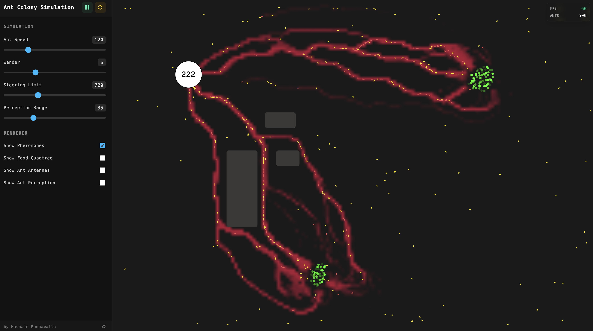

# Ant Colony Simulation

[**Try the Live Demo →**](https://hasnainroopawalla.github.io/ant-colony-simulation/)

Watch a colony of virtual ants come to life. Each ant wanders out from its nest, hunts for food, and finds its way back home — leaving behind scent trails that guide the rest of the colony. No single ant is in charge, yet together they discover the shortest paths to food. It's a mesmerizing example of how simple rules create complex, intelligent-looking behavior.

Curious about the algorithm itself? A Python version that finds the shortest path through a graph can be found here: [github.com/hasnainroopawalla/Ant-Colony-Optimization](https://github.com/hasnainroopawalla/Ant-Colony-Optimization).

<p align="center">

</p>

## What's Happening?

Real ants don't have a map. Instead, they drop tiny chemical trails called **pheromones** as they move. When an ant finds food, it lays down a trail on the way home. Other ants smell that trail and tend to follow it — and the more ants that use a good path, the stronger its scent becomes. Over time, the whole colony converges on efficient routes, all without any central planning.

This simulation recreates that behavior:

- 🐜 **Ants** explore, search for food, and carry it back to the nest
- 👃 **Scent trails** build up along popular routes and slowly fade over time
- 🍔 **Food clusters** get discovered and gradually cleared out
- 🧱 **Obstacles** force the ants to navigate around walls
- 🏠 **The nest** is home base, where ants return with their finds

## Play With It

The simulation is fully interactive. Use the control panel to tweak how the ants behave and watch the colony react in real time:

- **Ant Speed** — how fast the ants move
- **Wander** — how much the ants explore versus stick to trails
- **Steering Limit** — how sharply ants can turn
- **Perception Range** — how far ahead an ant can "smell"

There's also a live stats panel so you can keep an eye on what the colony is up to.

## Run It Locally

You'll need [Node.js](https://nodejs.org/) installed. Then:

```bash
# install dependencies
yarn install

# start the simulation
yarn dev
```

Open the link printed in your terminal and the simulation will load in your browser.

## Behind the Scenes

Built with [p5.js](https://p5js.org/) for the visuals, [React](https://react.dev/) for the interface, and [TypeScript](https://www.typescriptlang.org/).

## Contributing

Found a bug or have an idea? Open an issue on the [issues page](https://github.com/hasnainroopawalla/ant-colony-simulation/issues). To contribute code, fork the project and open a pull request back to master.

## License

Licensed under the MIT License — see the [LICENSE](https://github.com/hasnainroopawalla/ant-colony-simulation/blob/86c7974afc16431838be1e629e38719b1205f07b/LICENSE) file for details.
